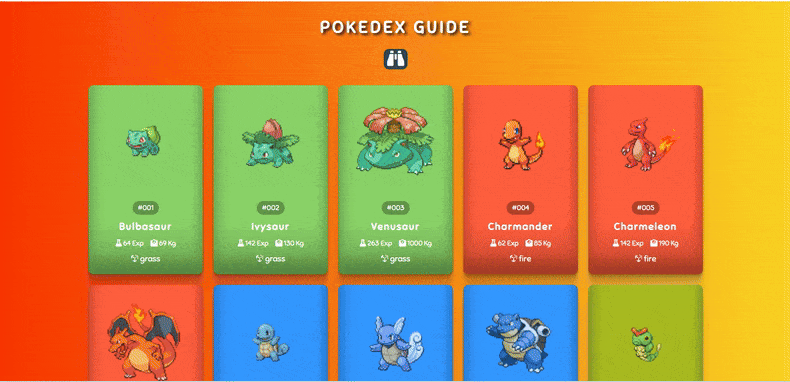

</head>
<body>
    

        <h2 class="title">☑ Pokemonlar görseldeki gibi  dizayn edildi</h2>
        <h2>
             Pokemon severler için tasarlandı 
             Bu proje, Pokémon meraklıları için tasarlanmış maziyi hatırlatan  bir web uygulamasıdır. Pokémonlara  dair  bir rehber görevi görür ve görsel olarak  
        poekmonların ağırlığı  ,expsi,özellikleri  grassı sunuldu ,arkaplan renkleri ,üzerine gelince büyütme eklendi 
        </h2>
        <h3> ☁Kullanılan yazılım dili  
           🗸JavaScript  
           🗸 Css  
            🗸 Html-5  
            ☁Özellikler
            Görsel sunum için javaScript,html,Css ile entegre edilerek   dizayn yapıldı 
            Duyarlı Tasarım: Uygulama mobil uyumlu olacak şekilde tasarlanmıştır ve farklı ekran boyutlarına sorunsuz bir şekilde uyum sağlar. 

            Dinamik Pokémon Kartları: Her Pokémon, görsel açıdan zengin bir kartla gösterilir ve şunları içerir: 
            ID ve İsim: Pokémon'u ID'si ve ismiyle hızlıca tanımlayın. 
            Deneyim Puanları: Pokémon'un temel deneyim puanlarını gösterir. 
            Ağırlık: Daha fazla ayrıntı için Pokémon'un ağırlığı hakkında bilgi. 
            Tür Simgesi: Pokémon'un türünün hızlı tanımlanması için grafiksel gösterimi. 
            Modern Kullanıcı Arayüzü: CSS kullanılarak tasarlandı ve ilgi çekici bir kullanıcı deneyimi için Font Awesome simgeleriyle geliştirildi. 

        </h3>

